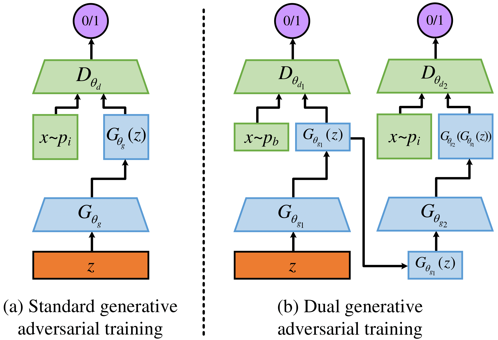
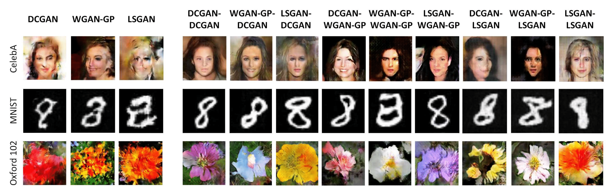

# Image Generation from Brainwaves using Dual Generative Adversarial Training

<!--
[](https://creativecommons.org/licenses/by-nc-sa/4.0/)
[](https://hits.seeyoufarm.com)
 -->





This repository provides the dataset and code for the following paper:

**Paper**: Image Generation from Brainwaves using Dual Generative Adversarial Training

**Authors**: Yen-Chiao Wang, Yi-Jie Chen, and Bo-Hao Chen
<!--
in [IEEE TITS](https://ieeexplore.ieee.org/document/9357944).
 -->


## Abstract
Representing content of brainwaves captured through a non-invasive EEG device is of practical importance to various diagnostic applications. Although existing generative adversarial networks can obtain decent results in certain fields of neuroscience, performance declines significantly when representing content of brainwaves due to the insufficiency of real brainwaves. This lets us introduce a dual generative adversarial training paradigm to learn a smooth transition between brainwave and target image distributions. Our experiments demonstrate that our training approach outperforms the state-of-the-art training strategy on three benchmark datasets.

## Requirements

### Dependencies
* cuda 10.2
* cudnn 7.3.1
* Python 3.8
* numpy 1.20.3
* matplotlib 3.5.3
* pytorch 1.9.1
* scikit-image 0.17.2
* pillow 8.3.1
* torchvision 0.10.1

### Dataset
* The flowers image dataset for training G2 can be downloaded from [here](https://www.robots.ox.ac.uk/~vgg/data/flowers/102/).
* The faces image dataset for training G2 can be downloaded from [here](https://mmlab.ie.cuhk.edu.hk/projects/CelebA.html).

### It was tested and runs under the following OSs:
* Windows 10

Might work under others, but didn't get to test any other OSs just yet.

## Getting Started:
### Usage
1. Clone this github repo. 
```
git clone https://github.com/bigmms/DualGAN
```
2. Please `cd` to the `DCGAN-DCGAN`, `DCGAN-LSGAN`, `DCGAN-WGAN-GP`, `LSGAN-DCGAN`, `LSGAN-LSGAN`, `LSGAN-WGAN-GP`, `WGAN-GP-DCGAN`, `WGAN-GP-LSGAN`, or `WGAN-GP-WGAN-GP`,  and run following command for evaluation:

* Training G1
```bash
$ python train1st.py -save_path=/model/save/path
```
* Training G2
```bash
$ python train2nd.py -save_path=/model/save/path
```
* Testing G1
```bash
$ python test_g1.py -load_path=/your/generator/model/path -num_output=/output/number
```
* Testing G2
```bash
$ python test_g2.py -load_path=/your/generator/model/path -test_path=/input/test/file -num_output=/output/number
```

## Results


Results of image generation using SGAT (Left) and our DGAT (Right) for different combinations of GANs on CelebA, MNIST, and Oxford 102 datasets. Please refer to our [paper](https://ieeexplore.ieee.org/document/9357944) for more information.

<!--
## License + Attribution
This code is licensed under [CC BY-NC-SA 4.0](https://creativecommons.org/licenses/by-nc-sa/4.0/). Commercial usage is not permitted. If you use this code in a scientific publication, please cite the following [paper](https://ieeexplore.ieee.org/document/9357944):
```
@ARTICLE{ChenTITS2021,  
 author={Chen, Bo-Hao and Ye, Shiting and Yin, Jia-Li and Cheng, Hsiang-Yin and Chen, Dewang}, 
 journal={IEEE Transactions on Intelligent Transportation Systems},  
 title={Deep Trident Decomposition Network for Single License Plate Image Glare Removal},  
 year={2022}, 
 volume={23}, 
 number={7}, 
 pages={6596-6607}, 
 doi={10.1109/TITS.2021.3058530}}
```
 -->